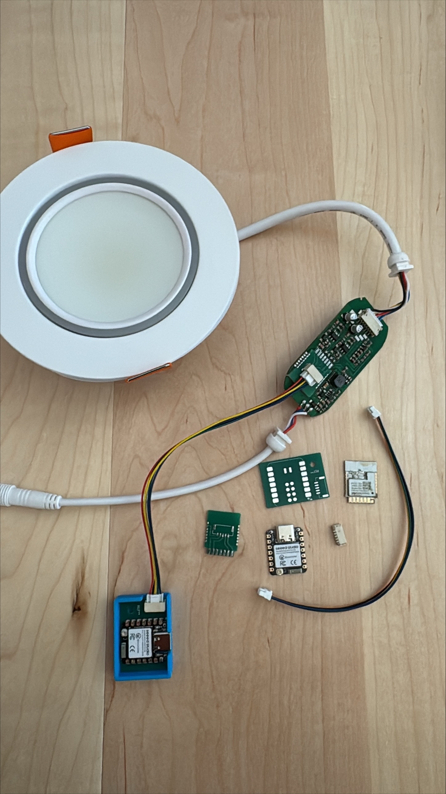
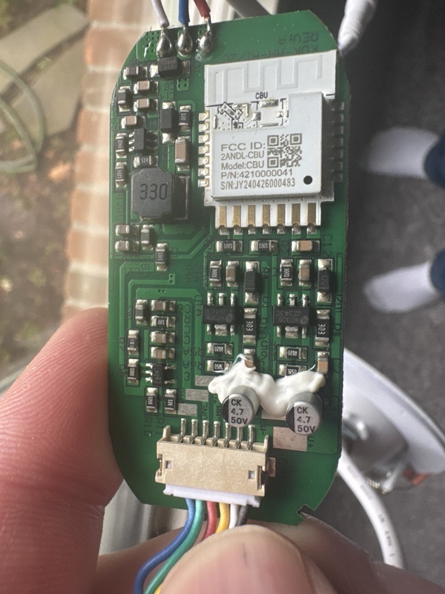
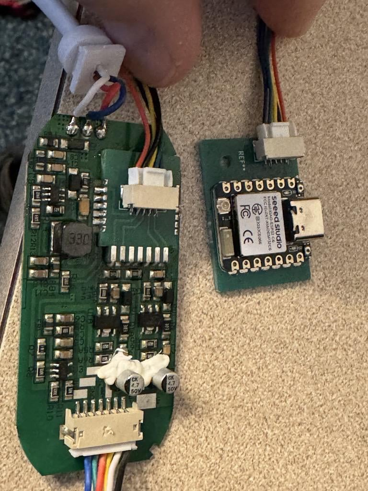

# Lumary ESPHome Gimbal Lighting

## Overview

This project provides ESPHome-based replacement firmware and hardware modifications for Lumary Smart Gimbal Recessed Lighting fixtures. These lights originally used proprietary cloud-dependent controllers. While there are hacks to install ESPHome on the original CBUs, they can be unreliable. This project replaces the stock microcontroller with an [ESP32-C6](images/original_post.jpg), enabling full local control via ESPHome and seamless integration with Home Assistant.

The hardware modification involves designing a custom PCB that serves as a drop-in replacement for the original controller board, allowing easy installation without extensive wires to solder. The firmware is built using ESPHome, providing robust WiFi connectivity and support for future Zigbee upgrades if desired.

## Features

- **Local Control**: Independent operation without reliance on manufacturer servers
- **Home Assistant Integration**: Native support for Home Assistant automation and control
- **[ESP32-C6](images/original_post.jpg) Compatibility**: Modern microcontroller with Wi-Fi and Bluetooth capabilities
- **Custom PCB Design**: Drop-in replacement board for simplified hardware modification
- **Open-Source Firmware**: Based on ESPHome for community-driven improvements
- **Hardware Mod**: Detailed instructions and files for replacing the stock microcontroller

## Repository Structure

- [`lumary_gimbal.yaml`](lumary_gimbal.yaml) - ESPHome configuration file for the Lumary gimbal lights
- `hardware/` - Hardware design files
  - `kicad/` - KiCad PCB design files
    - `CBU-Drop-in/` - Drop-in replacement PCB for original CBU (LearningTest2 files)
    - `CBU-Replacement-Daughterboard/` - Satellite board with ESP32-C6
  - `3d_models/` - 3D printable enclosure files (STL, OBJ formats)
- `images/` - Screenshots and diagrams
- `README.md` - This file

## Requirements

### Hardware
- Lumary Smart Gimbal Recessed Lighting fixture (typically 6-inch recessed cans)
- [ESP32-C6](images/original_post.jpg) microcontroller (Seeed Studio)
- Custom replacement PCB (designed for this project)
- Hot plate or ability to SMD solder tiny pads

### Software
- ESPHome

## Installation

### Hardware Modification
1. **Safety First**: Disconnect power and ensure the fixture is safe to work on.
2. **Disassemble**: Carefully open the controller box between the power supply and the light to access the internal controller board.
3. **Remove Stock CBU**: Locate and desolder the original microcontroller.
4. **Solder ESP32 and connectors**: Solder the connector to the drop-in board, and solder the ESP32 and a connector to the satellite board.
5. **Install Drop-In PCB**: Replace the original board with the custom [ESP32-C6](images/original_post.jpg) PCB designed for this project. The PCB is engineered as a drop-in replacement with matching pinouts.  
6. **3D print enclosure**: Print and install the ESP32 into the 3D-printed enclosure.
7. **Connect the two boards**: Connect the two boards using the cable.
8. **Cut wire notch**: In the plastic case where the original controller was housed, notch out a space for the wires (e.g., using diagonal snips).
9. **Reassemble**: Put the case back together securely.

## Disclaimer

This project is provided as-is, without warranty. Hardware modifications carry risks including electrical shock, fire, or device damage. The authors are not responsible for any consequences of using this information. Lumary is a trademark of their respective owners.