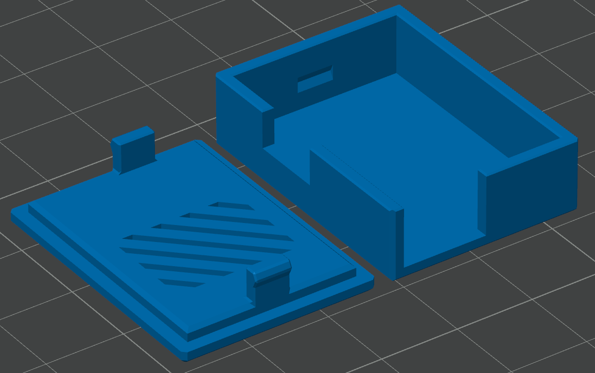

# 3D Models

This directory contains 3D printable files for enclosures and mounting hardware.

## Files

- **ESP32C6UpgradeBox.3mf** - Ready-to-print 3MF file for the ESP32-C6 daughterboard enclosure
- **ESP32C6UpgradeBox.f3d** - Autodesk Fusion 360 source file (editable)
- **ESP32C6UpgradeBox.step** - STEP file for CAD compatibility and modification

## Printing Recommendations

- Lay pieces on bed appropriately.

- Layer height: 0.2mm
- Infill: 20-30%
- Material: PLA or PETG
- Supports: Not Needed
- It's a pretty tight fit.

## Contributing

If you design or improve upon the enclosures, please consider contributing your STL files back to this project!

